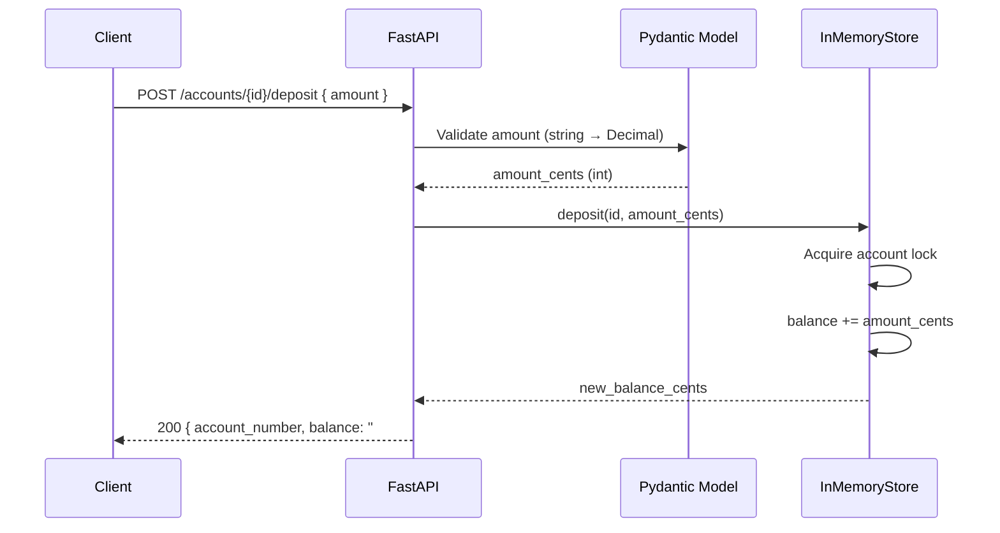

# Mini Project – ATM Server (FastAPI)

A minimal server-side ATM system with in-memory accounts and three operations:

- GET /accounts/{account_number}/balance
- POST /accounts/{account_number}/deposit
- POST /accounts/{account_number}/withdraw

Note: Data is stored in memory (no database). Balances reset on restart.

## Overview

This project implements the server-side of an ATM system. It exposes a small, well-typed HTTP API using FastAPI. Money is represented internally as integer cents to avoid floating-point errors, and simple per-account locks ensure thread-safe updates during concurrent requests.

## Architecture and Design Decisions

- FastAPI + Pydantic v2 for typed, self-documented API and validation
- Money as integer cents, with helpers to format/parse amounts
- Clear separation of concerns:
  - `app/main.py`: HTTP API (routes, HTTP status, JSON)
  - `app/models.py`: Schemas and money helpers shared across layers
  - `app/storage.py`: In-memory, thread-safe store (per-account `Lock`)
- No database (per assignment), but storage is pluggable for future DB
- Simple, deterministic behavior for tests and portability (Docker)

### Challenges addressed

- Avoiding floating-point precision issues for money (use Decimal + integer cents)
- Ensuring atomic updates under concurrent access (per-account lock)
- Keeping API, validation, and storage concerns decoupled for maintainability

## API Reference

Base URL (local): http://127.0.0.1:8000

- GET `/health`
  - 200 → `{ "status": "ok", "accounts": ["1001", ...] }`

- GET `/accounts/{account_number}/balance`
  - 200 → `{ "account_number": "1001", "balance": "1000.00" }`
  - 404 → `{ "detail": "account not found" }`

- POST `/accounts/{account_number}/deposit`
  - Body: `{ "amount": "10.50" }` (string, positive, max 2 decimals)
  - 200 → `{ "account_number": "1002", "balance": "261.00" }`
  - 404 → `{ "detail": "account not found" }`

- POST `/accounts/{account_number}/withdraw`
  - Body: `{ "amount": "5.00" }` (string, positive, max 2 decimals)
  - 200 → `{ "account_number": "1002", "balance": "259.75" }`
  - 400 → `{ "detail": "insufficient funds" }`
  - 404 → `{ "detail": "account not found" }`

Interactive docs: http://127.0.0.1:8000/docs

## Local Development

Windows PowerShell
```
python -m venv venv
.\venv\Scripts\Activate.ps1
pip install -r requirements.txt
uvicorn app.main:app --reload
```

Preload demo accounts
```
$env:PRELOAD_ACCOUNTS='{"1001":"500.00","7777":"0.00"}'
uvicorn app.main:app --reload
```

## Testing
```
pip install -r requirements.txt
pytest -q
```

## Docker

Build and run directly with Docker
```
docker build -t atm-server:latest .
docker run --rm -p 8000:8000 atm-server:latest
```

Docker Compose (maps port 8000)
```
docker compose up --build
```

## Deployment (Render)

This project is deployment-ready on Render using the Dockerfile.

1) Push the repository to GitHub.
2) In Render: New → Web Service → Build from Git repository.
3) Select Docker as environment (Dockerfile is auto-detected).
4) Set environment variables as needed (optional):
   - `PRELOAD_ACCOUNTS` e.g. `{ "1001": "1000.00", "1002": "250.50" }`
5) Deploy. Render provides a URL like:
   - `https://<your-service>.onrender.com`

Add this URL to your submission.

## Example API Calls

Using curl
```
# Health
curl http://localhost:8000/health

# Get balance
curl http://localhost:8000/accounts/1001/balance

# Deposit 10.50
curl -X POST http://localhost:8000/accounts/1002/deposit \
  -H "Content-Type: application/json" \
  -d '{"amount":"10.50"}'

# Withdraw 5.00
curl -X POST http://localhost:8000/accounts/1002/withdraw \
  -H "Content-Type: application/json" \
  -d '{"amount":"5.00"}'
```

## Project Layout

```
app/
  __init__.py
  main.py
  models.py
  storage.py
tests/
  test_api.py
.dockerignore
.gitignore
docker-compose.yml
Dockerfile
requirements.txt
README.md
```

---

## Differentiators at a Glance

- Money-safe by design: Decimal parsing + integer cents storage, never floats.
- Concurrency-aware: per-account locks guarantee atomic updates without a DB.
- Clean contracts: strict Pydantic validation and predictable error shapes.
- No magic values: routes, messages, and keys centralized in `app/constants.py`.
- Drop-in replaceable storage: swap in a DB later without changing the API.

## Executive Summary

This is a minimal ATM service implemented with production-minded patterns. The code is intentionally small, yet it demonstrates clarity, safety, and extension points. The API is stable, inputs are validated, monetary rules are explicit, and operational concerns are considered from day one (health checks, containerization, and deterministic tests).

## Architecture Diagram

```mermaid
graph TD
  A[Client] -->|HTTP JSON| B[FastAPI App]
  B --> C[Models (Pydantic)]
  B --> D[InMemoryStore]
  D -->|Per-account Lock| D
  C --> E[Money Helpers]
  B --> F[Constants (routes, messages)]
```

## Sequence: Deposit Request



## Design Tenets & Invariants

- Monetary precision
  - Parse as Decimal; store as integer cents.
  - Round half-up at two decimal places. Balance is always formatted as a string.
- Concurrency safety
  - Per-account `Lock` ensures atomic deposit/withdraw.
  - For multi-instance scaling, replace store with DB + transactions or distributed locks.
- Error taxonomy (consistent and simple)
  - 400 → invalid input or insufficient funds
  - 404 → account not found
  - Body shape `{ "detail": "<message>" }`
- Constants, not literals
  - All user-facing messages, routes, and JSON keys are defined in `app/constants.py`.

## Configuration & Defaults

- `PRELOAD_ACCOUNTS` (JSON) seeds initial balances, e.g. `{ "1001": "1000.00" }`.
- Sensible demo defaults are included (1001, 1002, and more) for instant testing.
- Precedence: Environment overrides defaults; invalid env values fail fast with a clear message.

## Operational Notes

- Health check: `GET /health` for simple liveness.
- Containers: Dockerfile and Compose provided for reproducible runs.
- Tests: pytest-powered integration tests run end-to-end in ~1–2 seconds on a typical dev machine (Windows).

## Security & Compliance (Scope-aware)

- This assignment omits auth by design. For real deployments:
  - Require TLS and authenticated requests (e.g., OAuth2/JWT).
  - Rate-limit endpoints; monitor for abuse.
  - Keep PII out of logs; add audit trails for financial operations.

## Performance & Scaling

- O(1) balance lookups and updates in-memory.
- Vertical scaling: simple; Horizontal scaling: swap `InMemoryStore` for a DB-backed repository using transactions.
- The API surface remains the same; only the storage implementation changes.

## Extensibility Roadmap

- Atomic transfers: two-account debit/credit under a single transaction.
- Persistence: Postgres repository with migrations (e.g., Alembic).
- Idempotency keys on POSTs to make retries safe.
- Observability: request logging, metrics, and tracing hooks.
- i18n: swap messages in `constants.py` for localized bundles.

## FAQ for Reviewers

- Why strings for balances in responses?
  - To preserve formatting and avoid client-side floating precision issues.
- Why not floats anywhere?
  - Money requires exactness; floating-point causes rounding drift.
- Can I add accounts at runtime?
  - Yes, the store supports creation; it’s not exposed as a public route to keep the surface minimal.

## Quick Runbook

- I see 404 for an account
  - Use one of the default demo accounts (e.g., 1001), or seed custom accounts via `PRELOAD_ACCOUNTS`.
- PRELOAD parsing failed
  - Ensure valid JSON string and amounts with at most two fractional digits.
- Port in use
  - Stop any existing server bound to 8000 (Uvicorn or Docker container).


